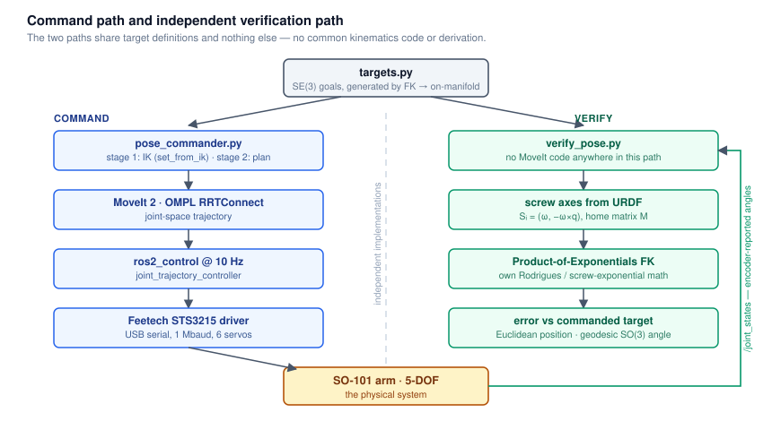
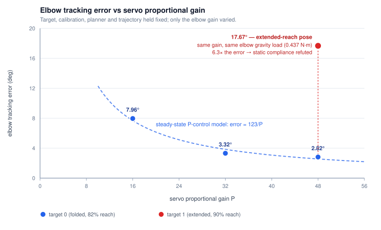

# Where a kinematic model stops predicting a physical arm

**Technical note — task-space pose commanding on a 5-DOF SO-101, with independent verification**

---

## 1. Summary

I built a task-space pose commander for a 5-DOF SO-101 arm (ROS 2 Jazzy / MoveIt 2) and a
separate forward-kinematics verifier derived from Product of Exponentials off the URDF. The
verifier shares no code and no derivation with the planner — a controller checking its own
math is not validation, so the check had to be built from an independent implementation.

In simulation the commanded pose is reached to **0.56 mm**. On hardware, the same code against
the same target reaches **20.0 mm** — roughly 36× worse. The gap is not kinematic: forward
kinematics of the joint vector actually sent to the servos lands **0.30 mm** from the target,
so the plan is correct and essentially all of the error is one joint failing to arrive at its
commanded angle. A gain sweep confirms the error behaves as proportional-control steady-state
error. A gravity-torque model, computed from the URDF inertials, then **fails** to explain how
that error varies between poses — which is the more interesting half of the result.

---

## 2. System and method

Two-stage commanding: inverse kinematics first (`set_from_ik`), then a joint-space plan to
that solution, so an IK failure and a planning failure are reported separately rather than
collapsing into one opaque result. Planning is OMPL RRTConnect through MoveIt 2; execution
runs through `ros2_control` at 10 Hz into a `joint_trajectory_controller`; the hardware
interface drives six Feetech STS3215 serial servos over USB at 1 Mbaud.

The verifier subscribes to `/joint_states`, extracts screw axes Sᵢ = (ω, −ω×q) and the home
matrix M from the URDF in a single zero-configuration pass, and evaluates forward kinematics
with its own Rodrigues/screw-exponential implementation. Both programs import the same target
definitions and nothing else.

---

## 3. How error was measured

**Error definitions.** Position error is the Euclidean norm ‖p_FK − p_target‖ in `base_link`.
Orientation error is the geodesic angle on SO(3), `acos((tr(RᵀR_target) − 1)/2)` — not a
difference of roll/pitch/yaw components, which are ill-conditioned near the pitch ≈ ±90°
region several of these poses occupy.

**Orientation on a 5-DOF arm.** A 5-DOF arm cannot reach arbitrary SE(3) poses, so orientation
error is only meaningful if the targets are reachable to begin with. Targets were therefore
*generated by forward kinematics* from chosen joint vectors, placing them on the reachable
manifold by construction. A third target was placed 5 cm beyond the measured 0.546 m workspace
boundary as a negative control — it is expected to fail, and how it fails is recorded.

**Trials and coverage.** Two reachable targets plus the unreachable control. Both reachable
targets lie in the sagittal plane (y ≈ 0, shoulder_pan ≈ 0) at 82% and 90% of maximum reach,
so the workspace sampling is a narrow slice with no lateral coverage. The gain sweep is a
single trial per gain setting. Target 1 is the only repeated condition, and the repetition is
informative: the two trials differ by **6.9 mm** in task space (28.1 and 21.3 mm) while their
elbow tracking errors agree to **0.8°** (17.67° and 16.88°). Joint-level tracking therefore
repeats tightly, and the task-space figure inherits several millimetres from sub-degree
differences in the remaining joints at 90% reach. Every other number here is a single trial
and should be read as a point estimate, not a characterised distribution.

**What each number is.** One trial, computed from the mean of 11–12 `/joint_states` samples
taken over 1 s once the arm had settled. Peak-to-peak spread across those samples was
0.0000 rad — below the 0.0015 rad encoder resolution. That bounds sensor noise on a stationary
pose; it is *not* a repeatability figure, since the arm does not move between samples. The
trial-to-trial spread quoted above is the repeatability figure: 0.0138 rad at the elbow, about
nine times the encoder resolution that bounds the within-pose number.

**Simulation/hardware parity.** Identical targets, verifier, commander and launch path in both.
One difference matters: simulation uses `mock_components/GenericSystem`, which echoes commands
back as state. The 0.56 mm simulation figure therefore measures numerical agreement between
MoveIt's IK and the independent PoE forward kinematics — an upper bound on implementation and
convention error across two separate derivations. It is not a physical measurement.

**The instrument's blind spot.** The verifier computes forward kinematics from *servo-reported
joint angles*. Any deflection between the encoder and the actual link is structurally invisible
to it. **The hardware figures below are therefore a lower bound on true end-effector error**,
not a measurement of physical pose. This is the honest limit of encoder-based self-verification
and it constrains what Section 5 can conclude.

*One threat to validity was found and eliminated before these measurements: a serial-bus fault
was silently attributing each servo's reply to the previously-queried servo, corrupting all
joint state. Every measurement predating that fix was discarded.*

---

## 4. Result and diagnosis

| Condition | Position error | Orientation error |
|---|---|---|
| Commanded configuration — FK of the joint vector sent (T0 / T1) | 0.30 / 0.35 mm | 0.02° |
| Simulation, full pipeline (T0) | 0.56 mm | 0.01° |
| Hardware, T0 — folded, 82% reach, P = 48 | 20.04 mm | 4.59° |
| Hardware, T1 — extended, 90% reach, P = 48 (two trials) | 28.14 / 21.26 mm | 5.02° / 3.78° |
| Hardware, T2 — 5 cm beyond boundary (negative control) | IK failed after 1.052 s | — |

Real-world error is ≈36× simulation error at T0, and 38–50× at T1.

**Localisation.** Comparing commanded against encoder-reported angles *in the servo's own
coordinate frame* places the error in actuation rather than in kinematics or calibration: a
wrong calibration offset would servo accurately to a wrong physical pose, and a verifier bug
would appear in simulation too. At T0/P=48 the per-joint tracking errors are elbow **2.82°**,
wrist_flex 1.08°, and all others ≤ 0.97°. One joint dominates.

**Controlled experiment.** I varied the elbow servo's proportional gain (16 → 32 → 48), holding
target, calibration, planner and trajectory fixed. The predictions were stated in advance: a
kinematic or calibration fault is gain-invariant, whereas a steady-state proportional-control
error under a disturbance torque scales as 1/P. Measured elbow error was 7.96° → 3.32° → 2.82°,
with Δθ·P constant to within ±12% (127, 106, 136). Gain-invariant causes are eliminated.

**Falsification test.** The obvious disturbance is gravity, which predicts that two poses with
equal computed gravity torque at the elbow must show equal tracking error. Computing that torque
from the URDF inertial data:

| Pose | elbow gravity torque | elbow tracking error | implied stiffness τ/Δθ |
|---|---|---|---|
| T0, P = 48 | 0.438 N·m | 2.82° | 8.90 N·m/rad |
| T1, P = 48, trial a | 0.437 N·m | 17.67° | 1.42 N·m/rad |
| T1, P = 48, trial b | 0.437 N·m | 16.88° | 1.48 N·m/rad |

Same joint, same gain, the same gravity load — **6.0–6.3× the error**, in both trials. A static
compliance model is refuted, and the implied stiffness differs by a factor of six between two
poses that load the joint identically. The torque model is not degenerate: sweeping the forearm
through vertical moves elbow torque from 0.02 to 0.45 N·m, so the near-equal loads at T0 and T1
are a genuine coincidence of geometry (the forearm is close to horizontal in both). What
survives is direction-dependent
backlash, load history, or torque coupled from the shoulder — whose own gravity torque is 2.6×
higher at T1 (0.777 vs 0.303 N·m) and whose tracking error grows in step, from 0.45° to 6.14°.

The computation, including a self-check asserting agreement with the verifier's independent
forward kinematics, is in [`analysis/gravity_torque.py`](analysis/gravity_torque.py).

---

## 5. Interpretation and next steps

The kinematic model is correct and the divergence lives entirely in actuator tracking — a
rigid-body URDF has no vocabulary for a joint that does not arrive where it is commanded, so
there is no parameter in the model that could have been wrong. A digital twin built on geometry
alone will therefore diverge from the physical system under load in exactly this way, and the
remedy is identification against the real actuator rather than a correction to the model's
structure.

The immediate experiments are a gravity-load sweep (hold the elbow angle fixed while varying
shoulder lift, so elbow torque spans roughly 0.05–0.45 N·m) and a direction-reversal test
(approach one target from above and from below). Direction-dependent error implies backlash and
belongs in a hysteresis term; load-dependent error implies compliance and belongs as a
configuration-dependent stiffness fed forward at plan time. Both need proper replication; one
repeated condition is enough to show the spread exists, not to characterise it.

The binding constraint, though, is the instrument rather than the model. Because verification
runs on the servos' own encoders, link deflection is invisible to it and 20 mm is a floor, not
a measurement — closing that loop requires external ground truth, which for this class of
hardware means vision-based pose measurement. That is where this work runs out of instrument.

---

*Code, full engineering record and raw run logs: [`so101_pose_milestone`](../README.md).
Kinematics follow Lynch & Park, "Modern Robotics". Claude was used for code scaffolding and
debugging; the hardware integration, experiment design and interpretation are my own.*
